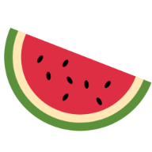

<a href="https://kevin-salamon.github.io/State-Management/"></a>

# Datagarden
A sample gardening app intended to test the limits of Redux to create a full app with very limited prop drilling and no back-end/database. Users have access to a full CRUD to view/add/delete/edit plants within the app, and the use of the tables and charts allow easy access to reference data for quick use. Should users want to save their plants and access them later, handy functionality with the "save plants" and "load plants" buttons will allow the saving and loading of state, respectively, within local storage.

---

```javascript
        case EDIT_PLANT:    
            return {    
                ...state,    
                plants: state.plants.map(    
                    (content, i) => content.id === action.payload.id ? {...content,
                        id: action.payload.id, 
                        name: action.payload.name, 
                        plantDate : action.payload.plantDate, 
                        growTime: action.payload.growTime, 
                        idealWater: action.payload.idealWater, 
                        idealSun: action.payload.idealSun, 
                        picture: action.payload.picture } : content)
            };
```

## Table of Contents

- [Installation](#installation)
- [Features](#features)
- [Usage](#usage)
- [Support](#support)
- [License](#license)

---

## Installation

#### The development of this app was made with create-react-app - please ensure that your machine possesses the same in order for the app to function locally.

### Clone

> Clone this repo to your local machine using: https://github.com/kevin-salamon/State-Management.git

### Setup

> Run 'npm install' in your CLI of choice in the project root directory.

```shell
$ npm install
```

> After installation, the program can be run with 'npm start' from the root directory.

```shell
$ npm start
```

---

## Features

#### Datagarden is an exercise in the functionality of Redux to allow the construction of a full global state with very limited use of prop drilling or a back-end.
- Different views in the form of data cards, tables, and charts allow for easy representation of your planting data, for future use without memorization.
- Even without the use of a database, users can save their plants within local storage and later load the same so that their plant data is never lost.
- Fully mobile-responsive site.

## Usage
-coming soon

---

## Support

For problems, questions, or comments, reach out to me below:

- Email at theksalamon@gmail.com
- LinkedIn at https://www.linkedin.com/in/kevin-salamon/
- GitHub at https://github.com/kevin-salamon

---

## License

- **This project is licensed under the terms of the MIT license.**
- Copyright 2020 © Kevin Salamon
